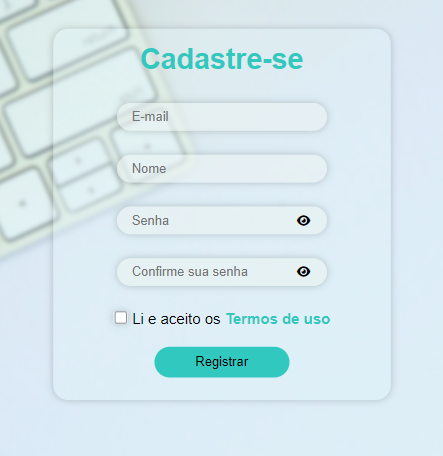

#Tela de cadastro de usuários

**Tecnologias utilizadas: HTML, CSS e JavaScript**

###O que esse projeto faz?

A finalidade do projeto é mostrar um formulário de cadastro com validações para auxiliar o usuário na hora do preenchimento, com o objetivo de evitar que ele insira dados inválidos/incorretos.

A validação é bem simples e tem como objetivo guiar o usuário na hora de preencher os campos.
Se ele estiver mal intensionado, a validação que tenho no projeto não será o suficiente para impedi-lo de usar o sistema incorretamente. Para garantir melhor segurança, seriam necessárias validações do lado do servidor.

###Passeando pelo código

Nas primeiras linhas foram feitas as declarações das variáveis que foram utilizadas ao longo do projeto.

Depois foi criado um evento de click no ícone de olho que está presente nos inputs de senha e confirme a sua senha. Ele serve para o usuário ter a opção de tornar a senha visível caso queira e escondê-la novamente.

Em seguida, foi criado um objeto constructor de classe Validator, onde foram declaradas as validações que foram colocadas nos inputs no código HTML.

A validação ocorre por meio do método 'validate'.

Foi criada uma variável do tipo 'let' para ser possível verificar se já está sendo mostrada alguma validação, pois tem alguns inputs que estão com mais de uma validação, assim aparece apenas uma por vez e quando uma é corrigida ela desaparece.

Foi utilizado um operador de propagação para conseguir "pegar" os valores dos inputs para fazer as validações, sendo elas: 

- maxlength: Para limitar a 50 a quantidade de caracteres no campo 'nome', foi utilizado uma condicional para exibir a mensagem de erro caso passe dessa quantidade.

- emailvalidate: Tem a finalidade de garantir que seja cadastrado um e-mail padrão. Utilizei uma expressão regular (regex) - /\S+@\S+\.\S+/ - para definir um e-mail com o formato que vemos normalmente: um texto, o símbolo '@', o domínio, o '.' e o TLD: exemplo@dominio.com

- onlyletters: Também foi criado para o input 'nome'. É definido que o input pode receber apenas letras maiúsculas e minúsculas por meio de outra expressão regular - /^[A-Za-z]+$/

- required: Serve para impedir que o usuário consiga efetuar o cadastro sem enviar algum dos dados solicitados.

- equal: Tem a finalidade de comparar os campos senha e confirme sua senha, foi feito com o método equal. Ele compara o conteúdo digitado no campo 'confirme sua senha' com o que foi digitado no campo 'senha'.

- passwordvalidate: É para garantir uma senha relativamente forte. Faz com que só sejam aceitas senhas que contenha pelo menos uma letra maiúscula e um número. 
Foram declaradas variáveis para receberem letras maiúsculas e números, depois é feito um 'loop for' para verificar se esses valores foram inseridos no  input, caso não tenham sido inseridos, aparece a mensagem de erro informando o padrão de senha solicitado.

Em seguida, tem a declaração do método responsável por limpar as validações quando essas não forem mais necessárias e o método para impresssão das mensagens de validações, ou mensagens de erro, abaixo dos respectivos inputs.

Após isso, foram atribuidas as variáveis de tipo let para 'pegar' as infomações do formulário, para definir o evento do botão 'Registrar' e para a criação do Validator. 

###Concluindo...

O projeto, apesar de simples, contribuiu imensamente para o meu aprendizado. 
Desde a criação e estilização da tela até a finalização do código, pude revisar e aprender muitos conceitos.
Passei a compreender um pouco melhor a utilização de métodos e criação de objetos.
Também foi muito legal e desafiador organizar a lógica toda do projeto.
Levei uma semana para conseguir concluir e apesar dele não ter ficado exatamente como eu gostaria, resolvi separar em partes para não correr o risco de me enrolar, rs.
Pretendo inserir mais algumas funcionalidades futuramente para que ele possa ficar mais completo. 
Vou colocar uma página de login e quando o usuário fizer o cadastro, ficará armazenado no localStorage, assim ele poderá efetuar o login e ser redirecionado para uma página que representará a tela de entrada do site.
Também pretendo inserir a possibilidade de fazer login com o Google e com o Facebook por meio de suas API's.
